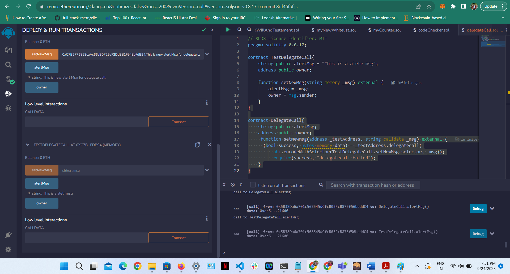
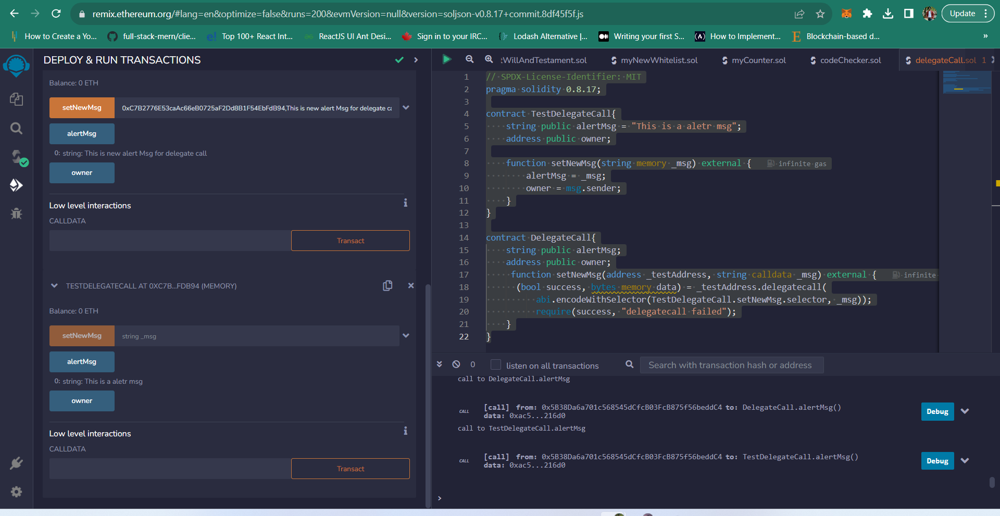

# BCDV-4028-LAB2
1-Delpoy contracts and copy the address of TestDelegateCall contract.
2- Paste it in setNewMsg fuction input box with new msg and call the fucnction

3-TestDelegateCall have its own msg and DelegateCall set new value.

